# Quiz Me

## Description
Our project is an online quiz application. When you log in you can either create a question or answer a question. When you create a question you are prompted to add a title, four possible answers and let us know which one is the correct answer. When you select the option to answer a question you are presented a random multiple choice question from the database. Stats also recorded.  

## Table of Contents
  - [Description](#description)
  - [Table of Contents](#table-of-contents)
  - [Installation](#installation)
  - [Usage](#usage)
  - [User Story](#user-story)
  - [Acceptance Criteria](#acceptance-criteria)
  - [Technology](#technology)
  - [License](#license)
  - [Questions](#questions)
  - [Credits](#credits)

## Installation 
Before attempting to use this application, you must have the follow programs installed to your computer: 

  - VS Code
  - Node.js
  
  In the terminal of VS Code please install enter the following to install all dependencies: 
  ```bash
  npm install
  ```
[Express.js](https://expressjs.com/en/starter/installing.html)

## Usage

 To use the application locally please clone the repo to your local environment.
 <br/>
 The application will be invoked by using the following command:

  ```bash
  node server.js
  ```
  Then in your preferred browser open  http://localhost:3001

Once you are on the webpage, you'll be presented with the homescreen, from which you'll the able to navigate the website.
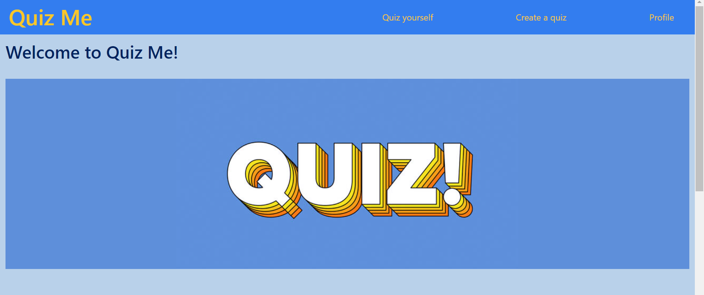
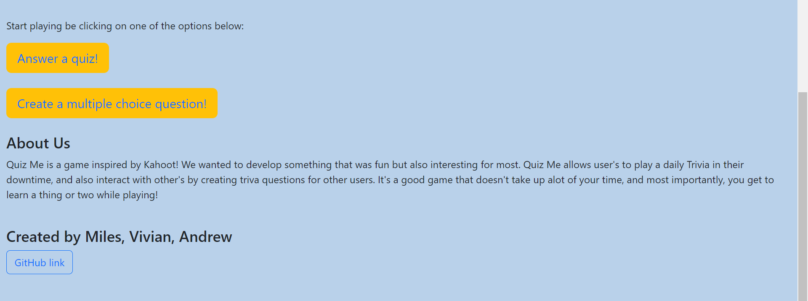 

However, before you're able to follow the links, you'll first need to either login or create a new account. Clicking any button on the homepage beforehand will automatically redirect you to a menu to do so.
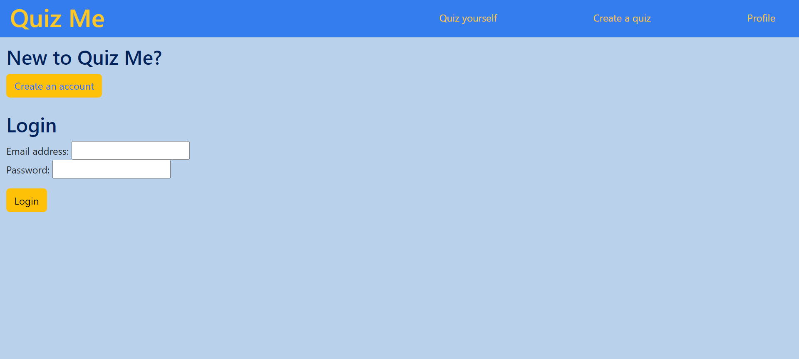 
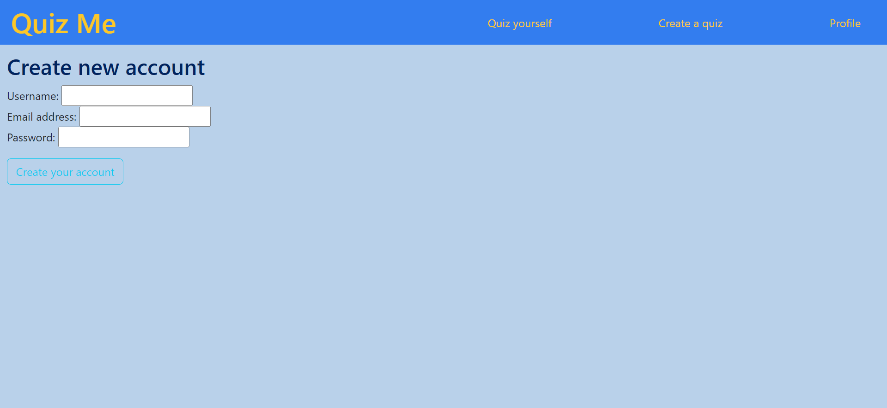

User details can be edited at any time by navigating to the bottom of Quiz Me's profile section and selecting the Edit Profile button next to the logout. From there you'll be taken to a small menu with with options for updating your information.
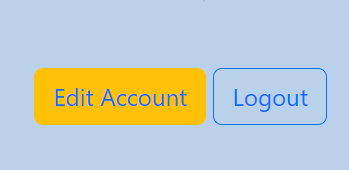 
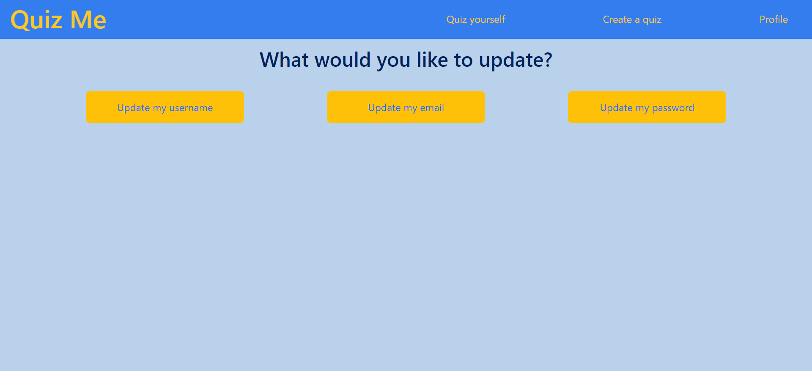 
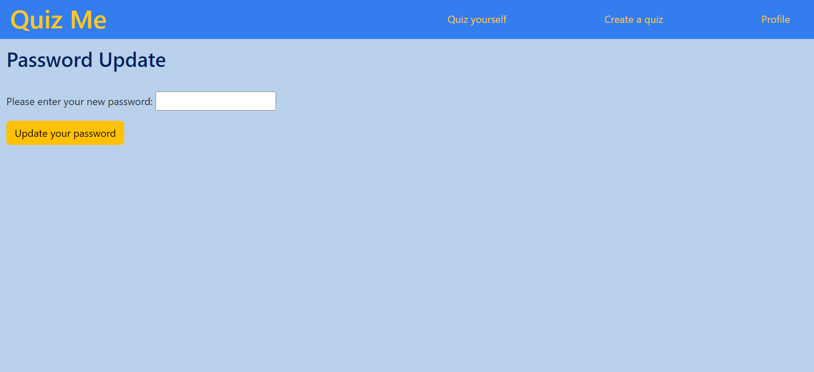 

The main feature of Quiz Me is your ability to download a question from our database to answer. While there are a finite amount of questions, there isn't a limit on how many you can answer in a given sitting and our system ensures that you won't receive the same question twice. The number of questions you've answered and gotten right can also be kept track of in the profile section.
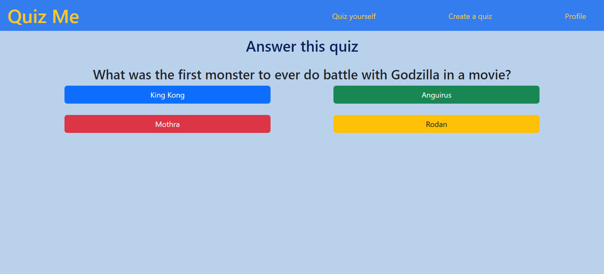 
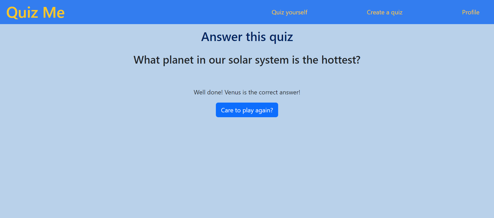 
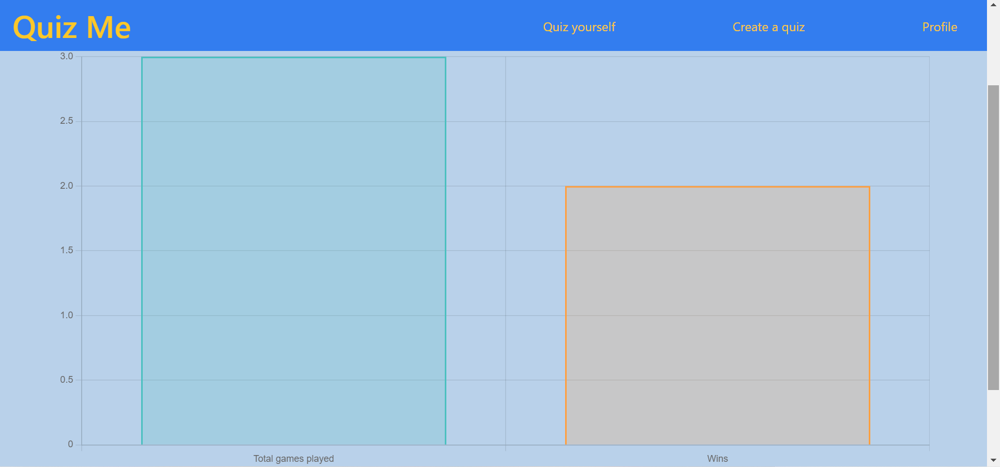 

On top of that, you also have the option submit your own questions for other people to answer. All you have to do is submit a question along with four possible answers and tell by selecting one which answer is correct.
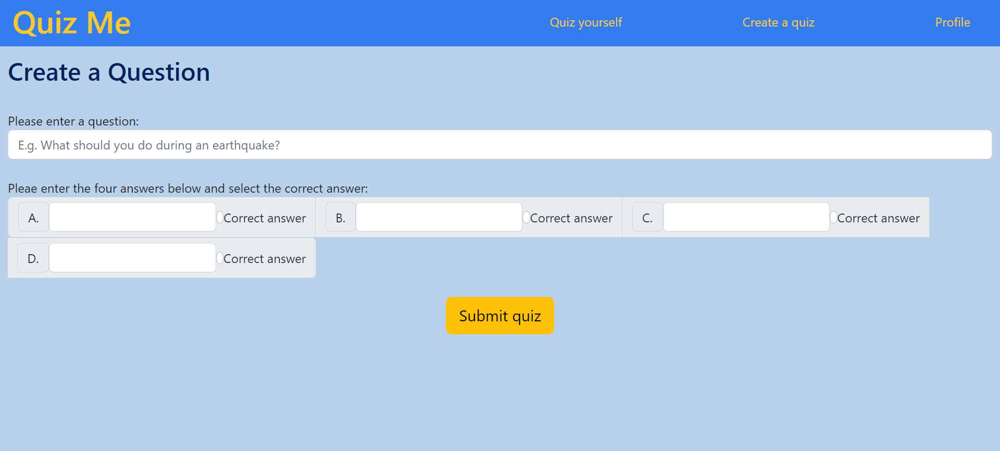 

## User Story
```
As a quiz enthusiast
I want to take random quizzes or create quizzes for others
So that I can learn and gain knowledge in a fun and social way 
```

## Acceptance Criteria
```
GIVEN a general knowledge quiz site
WHEN I enter the site 
THEN I am presented with options to either add my own question, answer a randomly selected one or view my profile
WHEN I try to perform an action when I am not logged in 
THEN I am redirected to either log in or sign up
WHEN I login or sign up
THEN a session is created and I am redirected back to the website with access to its features
WHEN I choose to add a question
THEN I am presented with a prompt to add a question along with four unique answers, along with indicating which answer is correct
WHEN I submit my question 
THEN it is saved to a database of other questions
WHEN I choose to answer a question
THEN I am given a random multiple choice question from the database among with four answers
WHEN I submit an answer to the provided question 
THEN I am told whether or not I answered it correctly and that question is saved to a database along with a win if I answered it correctly. A button then appears asking if I would like to do another one
WHEN I choose to do another question
THEN the page is refreshed with a new question
WHEN I choose to view my profile 
THEN I am taken to a page where I can view my number of wins and total quizzes played, edit my profile information or log out
WHEN I choose to edit my profile
THEN I am taken to a menu where I can choose to update my username, email or password
WHEN I choose what I want to update
THEN I am taken to a menu with a prompt to insert a new value
WHEN I enter an acceptable value
THEN I am redirected back to the editing menu
WHEN I choose to log out
THEN my session is terminated and I am redirected to homepage

```
## Technology
Technologies used in this project are:
* Visual Studio Code
* HTML
* CSS
* Javascript
* Express
* MySQL
* Sequelize
* Handlebars
* Sessions
* BCrypt
* Dotenv
* Chart.js

## License 


# Questions

## Feel free to reach out if you have any enquiries

Andrew Beissmann:
* Email: andrew60199@gmail.com
* GitHub: [@andrew60199](https://github.com/andrew60199)

Miles Thomas:
* Email: milesman2013@gmail.com
* GitHub: [@MDThomas1](https://github.com/MDThomas1)

Vivian Lee:
* Email: lalala.viv@hotmail.com
* GitHub: [@lalalaviv](https://github.com/lalalaviv)


## Credits 

* Andrew Beissmann
* Miles Thomas
* Vivian Lee